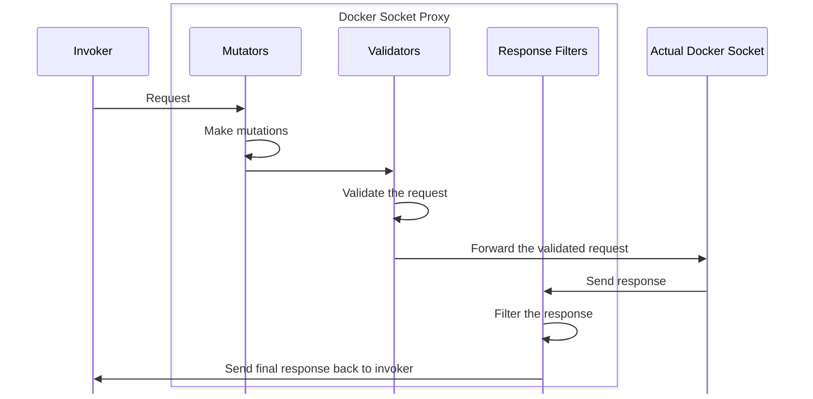

# Docker Socket Proxy

This project provides the ability to proxy requests going through a Docker socket and the ability to manipulate or block those requests.

With this socket, you can share it with other tools that need/want access to a Docker socket. But, it's more controlled.

Sample use cases might be to remap volume paths, add labels, or block certain registries.

> [!NOTE]
>
> Sockets created inside a container and mounted to the host do _not_ work as expected and is a known limitation.


## High-level Architecture

This proxy allows for a very similar pattern from Kubernetes where all API requests go through mutation and admission controllers before being accepted by the API. Additionally, response filters enable the ability to mutate or filter responses.



## Quick start - read-only access

1. Create a new (and proxied) Docker socket by running the following command:

    ```console
    docker run -d -v docker-socket:/tmp/socket -v /var/run/docker.sock:/var/run/docker.sock -e LISTEN_SOCKET_PATH=/tmp/socket/docker-proxy.sock -e CONFIG_DATA="gates: [ { type: readonly } ]" mikesir87/docker-socket-proxy
    ```

2. Start a new container, sharing the socket and specifying the `DOCKER_HOST` environment variable.

    ```console
    docker run -ti -v docker-socket:/tmp/socket -e DOCKER_HOST=unix:///tmp/socket/docker-proxy.sock docker sh
    ```

3. Try to pull a container image:

    ```console
    docker pull nginx
    ```

    You should see the following error:

    ```
    Error response from daemon: Read-only access is enabled
    ```

4. Try to create a volume:

   ```console
   docker volume create test
   ```

   You should see the same error!

5. But, list all containers. It should work:

   ```console
   docker ps
   ```

### Using the proxy with reverse proxies

The socket proxy, by default, will allow all requests. To change the rules, you will need to provide a YAML config file (see [Proxy configuration](#proxy-configuration) below).

To provide the configuration, you have two options:

1. **By file** - create a file and indicate its filepath by using the `CONFIG_FILE` environment variable
2. **By environment variable** - specify the YAML in the `CONFIG_DATA` environment variable

The following Compose file does the following:

1. Defines its configuration using the `CONFIG_DATA` environment variable
2. Specifies the `LISTEN_SOCKET_PATH` environment variable to put the new socket at `/tmp/socket-proxy/docker.sock`, which is a mounted volume named `socket-proxy`
3. The `socket-proxy` volume is shared with the Traefik container

The following Compose file creates the socket and puts it into a volume that is shared with a Traefik container. In this example, the Traefik container has only read access to the socket.

```yaml
services:
  traefik:
    image: traefik:3.2
    command: --providers.docker --providers.docker.endpoint=unix:///tmp/socket-proxy/docker.sock
    ports:
      - 80:80
    volumes:
      - socket-proxy:/tmp/socket-proxy

  socket-proxy:
    image: mikesir87/docker-socket-proxy
    volumes:
      - /var/run/docker.sock:/var/run/docker.sock
      - socket-proxy:/tmp/socket-proxy
    environment:
      LISTEN_SOCKET_PATH: /tmp/socket-proxy/docker.sock
      CONFIG_DATA: |
        gates:
          - type: readonly
volumes:
  socket-proxy:
```

## Proxy configuration

The following environment variables can be used to configure the proxy.

Either `CONFIG_FILE` or `CONFIG_DATA` must be specified.

| Variable            | Description                                                                 | Default value           |
|---------------------|-----------------------------------------------------------------------------|-------------------------|
| `CONFIG_FILE`       | Path to the middleware configuration YAML configuration file.  | None                    |
| `CONFIG_DATA`       | YAML configuration provided as an environment variable.                   | None                    |
| `LISTEN_SOCKET_PATH`| Path where the new proxy socket will be created.  | `/tmp/docker.sock` |
| `FORWARDING_SOCKET_PATH` | The socket the proxy should forward requests | `/var/run/docker.sock` |


## Middleware configuration

There are several middleware options available. 

- **Mutators** have the ability to modify the request on the way in
- **Gates** have the ability to block requests
- **Response filters** have the ability to modify the responses coming back from the engine

### Gates

#### Read-only gate

To enable read-only mode, add the readonly gate. No additional configuration is currently supported.

```yaml
gates:
  - type: readonly
```


#### Registry gate

To create an allowlist of the registries that are allowed to be used for image pulling, add the following gate:

```yaml
gates:
  - type: registry
    registries: ["docker.io", "ghcr.io"]
```

#### Namespace allowlist gate

To create an allowlist of the namespaces that are allowed to be used for image pulling, add the following gate:

```yaml
gates:
  - type: namespaceAllowlist
    namespaces: ["mikesir87"]
```

Note that the namespaces here is everything between the domain and the final repository name in an image name. For example, an image pull for `ghcr.io/mikesir87/demo` would have the namespace of `mikesir87`.

#### Mount source gate

To authorize new containers to only allow mount points from a specific location, use the following gate:

```yaml
gates:
  - type: mountSource
    allowedSources:
      - /path/to/source
      - volume-name
```

#### Image loading gate

To block all image loading, use the following gate:

```yaml
gates:
  - type: imageLoading
```


### Mutators

#### Mount path mutator

This mutator is helpful when doing Docker-out-of-Docker setups (sharing the Docker socket with a container) or devcontainer environments.

Notably, this will rewrite both volume paths and mount paths and is smart enough to create volume subpath configuration if needed.

To rewrite volume/mount paths during a container creation, add the following mutator:

```yaml
mutators:
  - type: mountPath
    from: /workspaces/test-repo
    to: /Users/mikesir87/git/test-repo
  - type: mountPath
    from: /workspaces/another-test
    to: workspace-volume
```

#### Add label mutator

To add labels to all created containers, images, networks, and volumes, add the following mutator:

```yaml
mutators:
  - type: addLabels
    labels:
      example.label.key: label-value
      another.label: another-value
```

#### Remap image mutator

The remap image mutator allows you to rewrite the images being used when creating containers. Note that multiple remappings can occur, but only one pass will run using the configured order.

```yaml
mutators:
  - type: remapImage
    from: nginx
    to: nginx:alpine
  - type: remapImage
    from: node:lts
    to: node:lts-alpine
```

### Response filters

#### Label filter

The label filter provides the ability to filter the collection listings of containers, images, networks, and volumes to include items that have either the required labels or omit forbidden labels.

The following snippet will filter all items and return ONLY those that match ALL specified required labels.

```yaml
responseFilters:
  - type: labelFilter
    requiredLabels:
      com.example.required-key1: value1
      com.example.required-key2: value2
```

The following snippet will filter all items and return ONLY those that do NOT have the specified labels.

```yaml
responseFilters:
  - type: labelFilter
    forbiddenLabels:
      com.example.forbidden-key1: value1
      com.example.forbidden-key2: value2
```

You are allowed to have a filter that defines both `requiredLabels` and `forbiddenLabels`.

## Contributing or requests

If you have requests for different types of mutators, create an issue and let's talk about it!
